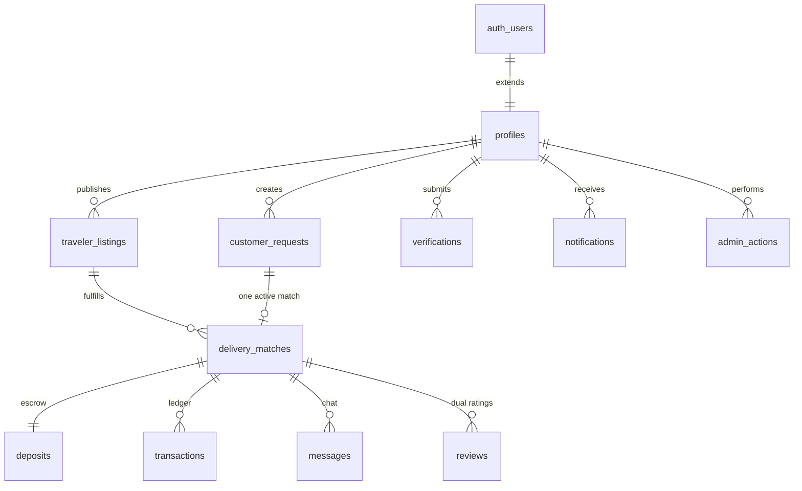

# Shiply Egypt — Database Schema Guide

PostgreSQL schema for Supabase. Auth users live in `auth.users`; app identity and marketplace data live in `public.*`.

## Entity relationship overview



### Core flow

1. **Traveler** publishes a `traveler_listings` row (`active`).
2. **Customer** publishes a `customer_requests` row (`open`).
3. Either party initiates a `delivery_matches` row linking **one listing + one request** (unique per `request_id`).
4. Customer funds `deposits` → status moves to `deposit_held`; `transactions` record Stripe events.
5. Parties chat via `messages` / `message_reads` on the match.
6. After delivery, both leave `reviews`; admins audit via `admin_actions`.

---

## Enum definitions

| Enum | Values | Purpose |
|------|--------|---------|
| `user_role` | `customer`, `traveler`, `admin` | Role array on `profiles.roles` |
| `listing_status` | `draft`, `active`, `paused`, `expired`, `cancelled` | Listing lifecycle |
| `request_status` | `draft`, `open`, `matched`, `in_progress`, `fulfilled`, `cancelled`, `expired` | Request lifecycle |
| `service_type` | `shop_and_ship`, `ship_only`, `both` | Traveler offering |
| `match_status` | `pending` → `completed` / `disputed` / `cancelled` | Deal state machine |
| `deposit_status` | `pending` → `held` → `released` / `refunded` | Escrow state |
| `transaction_type` | `deposit_capture`, `platform_fee`, `traveler_payout`, refunds… | Ledger categorization |
| `transaction_status` | `pending`, `processing`, `succeeded`, `failed`… | Payment processing |
| `verification_type` | `email`, `phone`, `government_id`, `passport`, `flight_itinerary`, `selfie_liveness` | KYC / trust |
| `verification_status` | `pending`, `in_review`, `approved`, `rejected`, `expired` | Verification workflow |
| `notification_type` | `match_update`, `message`, `deposit`, … | In-app categorization |
| `notification_channel` | `in_app`, `email`, `push`, `sms` | Delivery channel |
| `admin_action_type` | `user_suspend`, `deposit_release`, … | Audit taxonomy |
| `admin_target_type` | `user`, `traveler_listing`, `delivery_match`, … | Polymorphic target |

---

## Table reference

### `profiles` (users)

Extends `auth.users`. Single source of truth for marketplace identity.

| Column | Notes |
|--------|-------|
| `id` | FK → `auth.users.id` |
| `roles` | `user_role[]` — user can be customer + traveler |
| `stripe_customer_id` | Stripe Customer for deposits |
| `traveler_rating_avg` / `customer_rating_avg` | Denormalized; update via trigger/job from `reviews` |
| `is_suspended` | Admin moderation flag |

**Relationships:** Owns listings, requests, matches (as traveler or customer), verifications, notifications.

---

### `traveler_listings`

Trip capacity offered by a traveler.

| Column | Notes |
|--------|-------|
| `traveler_id` | FK → `profiles` |
| `origin_*` / `destination_*` | Route for search indexes |
| `arrival_at` | Primary sort for browse |
| `accepted_categories` | `TEXT[]` + GIN index for filters |
| `status` | Only `active` rows are public |

**Relationships:** `traveler_id` → `profiles`. One listing → many `delivery_matches` (over time; not concurrently for same slot if enforced in app).

---

### `customer_requests`

Item need posted by a customer.

| Column | Notes |
|--------|-------|
| `customer_id` | FK → `profiles` |
| `max_budget` / `currency` | Optional budget cap |
| `status` | `open` visible in marketplace |

**Relationships:** `customer_id` → `profiles`. **At most one** `delivery_matches` per request (`UNIQUE(request_id)`).

---

### `delivery_matches`

Binds a listing to a request and both parties. Central hub for chat, escrow, and reviews.

| Column | Notes |
|--------|-------|
| `listing_id`, `request_id` | FKs with `ON DELETE RESTRICT` — preserve financial history |
| `traveler_id`, `customer_id` | Denormalized for fast RLS and dashboards |
| `agreed_price`, `platform_fee_amount` | Commercial terms |
| `status` | Drives UI and allowed transitions |

**Relationships:**

- `listing_id` → `traveler_listings`
- `request_id` → `customer_requests` (1:1 while matched)
- `traveler_id`, `customer_id`, `initiated_by` → `profiles`
- 1:1 `deposits`
- 1:N `messages`, `transactions`, `reviews`

---

### `deposits`

Escrow holding customer funds until delivery confirmation.

| Column | Notes |
|--------|-------|
| `match_id` | `UNIQUE` — one escrow per deal |
| `stripe_payment_intent_id` | Stripe reconciliation |
| `status` | `held` = funds secured |

**Relationships:** `match_id` → `delivery_matches`, `customer_id` → `profiles`. Updates after `held` should go through **service role** (webhooks), not client.

---

### `transactions`

Append-only style **ledger** for all money movement (fees, payouts, refunds).

| Column | Notes |
|--------|-------|
| `idempotency_key` | `UNIQUE` — safe Stripe webhook retries |
| `metadata` | `JSONB` for raw Stripe payloads |
| `match_id` / `deposit_id` | Optional FKs for traceability |

**Relationships:** Links to match, deposit, and `user_id` (beneficiary/payer). No client INSERT policies — **Edge Functions / service role only**.

---

### `messages` + `message_reads`

Per-match chat. `messages` are immutable except soft-delete (`deleted_at`).

| Design choice | Why |
|---------------|-----|
| `message_reads` junction | Scales read receipts; index `(user_id, read_at)` for unread |
| Partial index on messages | `WHERE deleted_at IS NULL` keeps chat queries fast |

**Relationships:** `match_id` → `delivery_matches`; `sender_id` → `profiles`.

---

### `reviews`

Dual-sided ratings after `match.status = completed`.

| Constraint | Why |
|------------|-----|
| `UNIQUE(match_id, reviewer_id)` | One review per side per deal |
| `rating` 1–5 | Enforced at DB level |

**Relationships:** `match_id` → `delivery_matches`; `reviewer_id` / `reviewee_id` → `profiles`.

---

### `verifications`

KYC: passport, flight, ID, etc.

| Column | Notes |
|--------|-------|
| `document_storage_path` | Supabase Storage path — **never** expose publicly |
| Partial unique index | One active verification per `(user_id, type)` |

**Relationships:** `user_id` → `profiles`; `reviewed_by` → admin `profiles`.

---

### `notifications`

User inbox + outbound dispatch log.

| Column | Notes |
|--------|-------|
| `data` | `JSONB` — deep link IDs (`match_id`, etc.) |
| `read_at` | NULL = unread (partial index) |

**Relationships:** `user_id` → `profiles`.

---

### `admin_actions`

Immutable audit log for moderation and financial overrides.

| Column | Notes |
|--------|-------|
| `target_type` + `target_id` | Polymorphic reference |
| `metadata` | Before/after snapshots |
| `ip_address` | Compliance / abuse investigation |

**Relationships:** `admin_id` → `profiles` with `admin` role. **Insert/select admin only** via RLS.

---

## Suggested indexes (summary)

| Table | Index | Use case |
|-------|-------|----------|
| `traveler_listings` | `(destination_country_code, arrival_at)` partial `active` | Homepage / browse |
| `traveler_listings` | GIN `accepted_categories` | Category filters |
| `customer_requests` | `(status, needed_by, created_at)` partial `open` | Request feed |
| `delivery_matches` | `(traveler_id, status, updated_at)` | Traveler dashboard |
| `delivery_matches` | `(customer_id, status, updated_at)` | Customer dashboard |
| `messages` | `(match_id, created_at DESC)` partial not deleted | Chat pagination |
| `notifications` | `(user_id, created_at)` partial unread | Notification bell |
| `transactions` | `(status, created_at)` partial pending | Worker queue |
| `verifications` | `(status, submitted_at)` partial pending | Admin review queue |
| `admin_actions` | `(target_type, target_id, created_at)` | Entity audit trail |

---

## Security model

1. **RLS enabled** on all `public` tables (see `20260516000001_rls_policies.sql`).
2. **Financial writes** (`transactions`, deposit status after `held`) → Supabase **service role** + Stripe webhooks only.
3. **Sensitive files** → private Storage buckets; store paths in `verifications.document_storage_path`.
4. **Denormalized IDs** on `delivery_matches` avoid expensive joins in RLS checks.
5. **`is_admin()`** is `SECURITY DEFINER` — keep `search_path` pinned to `public`.
6. Never grant `admin` role via client `profiles` update (policy blocks unless already admin).

---

## Scalability notes

- **UUID v4** primary keys — safe for distributed inserts; consider time-ordered UUIDs later if needed.
- **Partial indexes** keep hot paths small as tables grow.
- **Denormalized ratings** on `profiles` — refresh via trigger or nightly job to avoid `AVG()` on every profile load.
- **Partitioning** (future): `messages` and `notifications` by `created_at` month when >10M rows.
- **Read replicas**: route browse/search to replica; writes to primary.
- **Archival**: move `completed` matches older than N months to `delivery_matches_archive`.

---

## Applying migrations

```bash
supabase db push
# or
supabase migration up
```

Files:

- `supabase/migrations/20260516000000_initial_schema.sql` — tables, enums, indexes
- `supabase/migrations/20260516000001_rls_policies.sql` — RLS policies

---

## Match status state machine (recommended)

```
pending → accepted → deposit_pending → deposit_held → in_transit
  → delivered → completed

Branches: disputed, cancelled, refunded (from several states)
```

Enforce valid transitions in application code or a dedicated `match_status_transitions` table + trigger.
